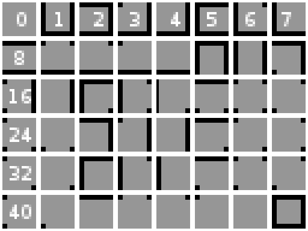
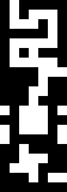
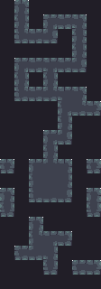

# Autotile

This library accepts a 2D array of truthy/falsey values representing the floor of a game level.
This library returns a 2D array of numbers corresponding to the tileset offset which should then be used.

* Example tileset by [Buch](https://opengameart.org/content/dungeon-tileset)
* Algorithm by [Sonny Bone](https://gamedevelopment.tutsplus.com/tutorials/how-to-use-tile-bitmasking-to-auto-tile-your-level-layouts--cms-25673)

This implementation uses the 8-bit (cornered) approach.
This implementation only works with 2 types of terrain (hence the true and false).

## Tileset

You'll need to create a tileset with your tiles laid in the same order as shown here:



The number of columns you use isn't as important, that will probably be handled by whatever rendering engine you're using.

## Usage

Imagine we have the following 2D representation of our levels floor, with white being floor and black being walls or holes:



This shape could look like the following (true/false or 1/0 both work).
In this array, falsey values represent an absense of floor (e.g. a wall) and truthy values represent the floor.

```javascript
const autotile = require('autotile');
const myLevel = [
  [0, 1, 0, 0, 0, 0, 0],
  [0, 1, 0, 1, 1, 1, 0],
  [0, 1, 1, 1, 0, 1, 0],
  [0, 0, 0, 0, 0, 1, 0],
  [0, 1, 1, 1, 1, 1, 0],
  [0, 1, 0, 1, 0, 0, 0],
  [0, 1, 1, 1, 1, 1, 0],
  [0, 0, 0, 0, 1, 1, 1],
  [0, 0, 0, 0, 1, 0, 0],
  [0, 0, 0, 1, 1, 0, 0],
  [0, 0, 0, 1, 0, 0, 0],
  [1, 0, 1, 1, 1, 0, 1],
  [0, 0, 1, 1, 1, 0, 0],
  [1, 0, 1, 1, 1, 0, 1],
  [1, 0, 0, 0, 0, 0, 1],
  [0, 0, 1, 0, 0, 0, 0],
  [0, 0, 1, 1, 1, 0, 0],
  [0, 1, 1, 1, 0, 0, 0],
  [0, 0, 0, 1, 0, 1, 1],
  [0, 0, 0, 0, 0, 0, 0],
];

const tiles = autotile(myLevel);

console.log(tiles);
```

Once we've run the map through `autotile` we will get the following result:



This is represented as an array of tileset offsets:

```json
[
  [ 0, 13, 0, 0, 0, 0, 0 ],
  [ 0, 14, 0, 18, 8, 15, 0 ],
  [ 0, 6, 8, 3, 0, 14, 0 ],
  [ 0, 0, 0, 0, 0, 14, 0 ],
  [ 0, 18, 8, 21, 8, 3, 0 ],
  [ 0, 14, 0, 14, 0, 0, 0 ],
  [ 0, 6, 8, 9, 37, 26, 0 ],
  [ 0, 0, 0, 0, 20, 10, 2 ],
  [ 0, 0, 0, 0, 14, 0, 0 ],
  [ 0, 0, 0, 18, 3, 0, 0 ],
  [ 0, 0, 0, 14, 0, 0, 0 ],
  [ 47, 0, 34, 43, 26, 0, 47 ],
  [ 0, 0, 36, 46, 28, 0, 0 ],
  [ 13, 0, 7, 12 4, 0, 13 ],
  [ 1, 0, 0, 0, 0, 0, 1 ],
  [ 0, 0, 13 0, 0, 0, 0 ],
  [ 0, 0, 35 29 2, 0, 0 ],
  [ 0, 5, 11 17 0, 0, 0 ],
  [ 0, 0, 0, 1, 0, 5, 2 ],
  [ 0, 0, 0, 0, 0, 0, 0 ]
]
```

## TODO

* Also implement a 4-bit (no corners) approach
* Allow for infinire number of terrain
